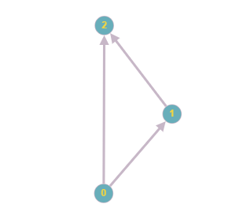

# Evaluation of the best path

The purpose of this program is to build a graph from a text file. This graph is composed of paths, which are themselves composed of vertices linked with a distance (longitude and latitude), the edges can be "stops" and obligatory points to pass during the path. The goal is to find the best possible path of this chart that goes through all the "stops".

## Example

Here is an example, the starting point is 0, and the last is 2. The program reads the text file (respecting the syntaxes) which gives the information of the graph: source point, destination point, list of vertices with longitude and latitude, edges and "stops". The program evaluates all possible routes through stops. It then compares for each route the total Euclidean distance. The best path has the minimum distance, here the best is 0 -> 1 -> 2, this example is simple so it only finds this one because there is a stop in 1 -> 2

## Output

